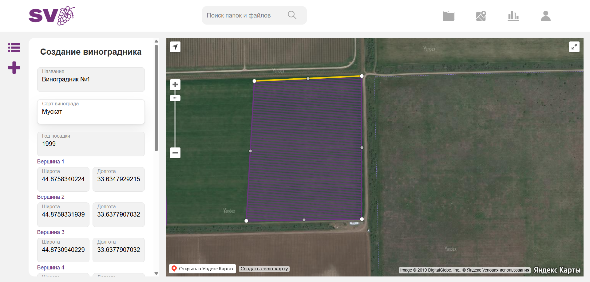
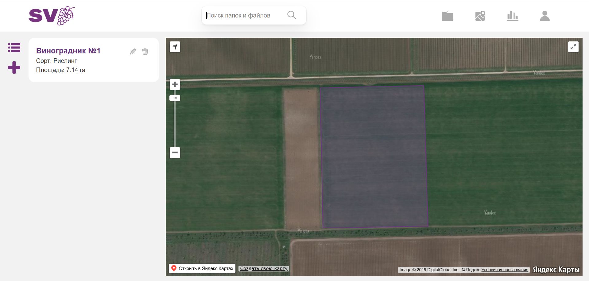
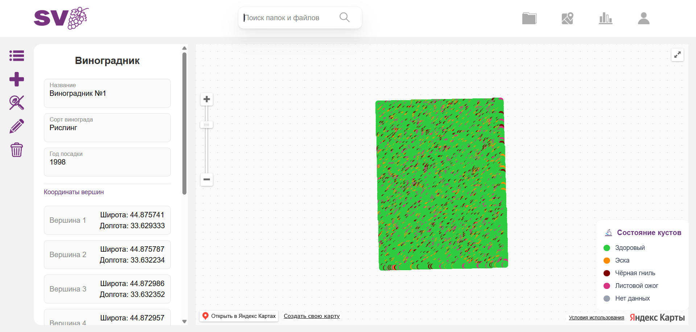
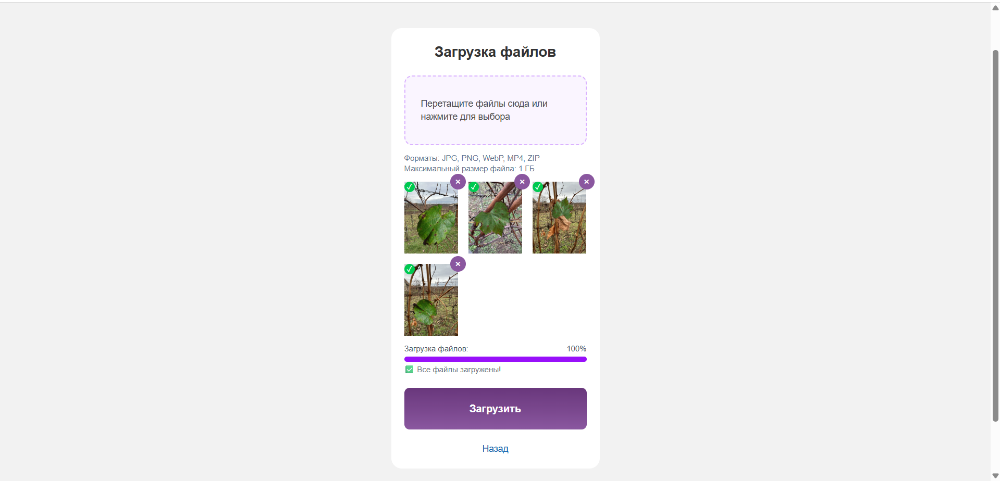
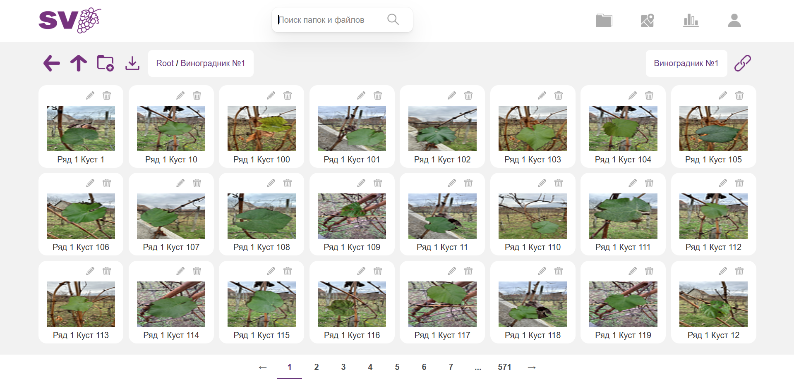
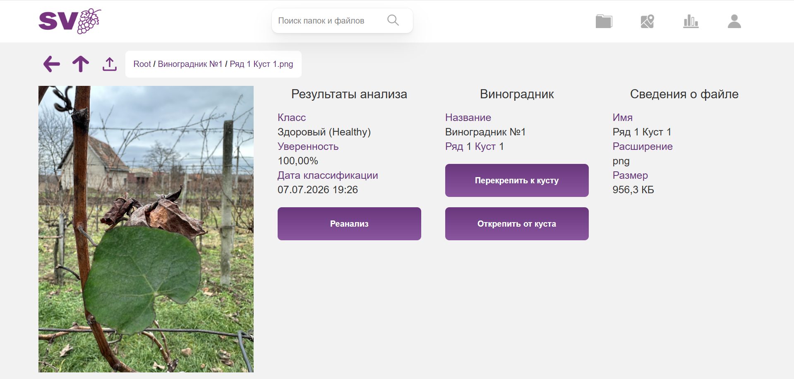
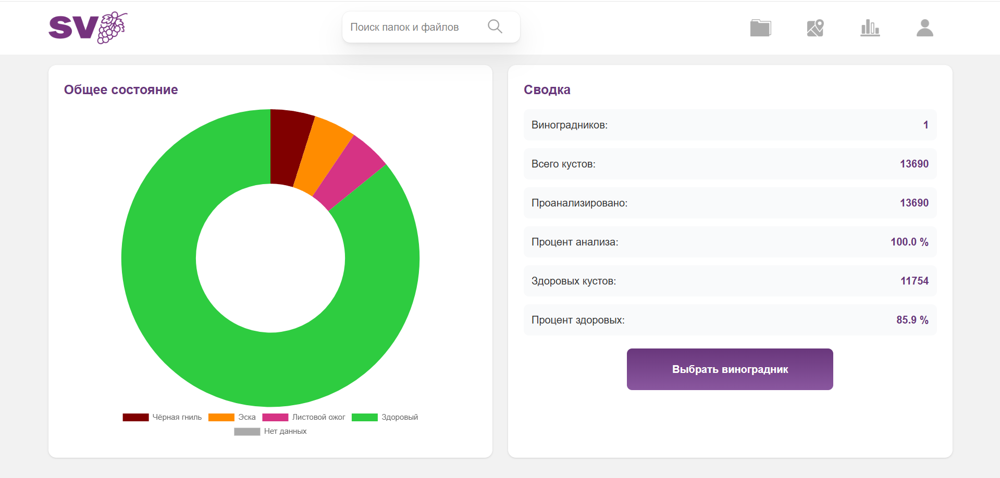

# Smart Vineyard

A web application for vineyard management with AI-based vine health classification.

## Screenshots

| Login | Create Vineyard |
|-------|----------------|
|  |  |

| Vineyard Map | Health Heatmap |
|-------------|---------------|
|  |  |

| File Upload | Media Explorer |
|------------|---------------|
|  |  |

| Classification Result | Statistics |
|----------------------|------------|
|  |  |

## Features

- **Vineyard map** — add and edit vineyards via an interactive map (Yandex Maps)
- **Row and bush structure** — automatic generation of rows and bushes from given parameters
- **Media library** — upload photos and videos, organize into folders, link to specific bushes
- **AI classification** — analyze vine health from a photo (black rot, ESCA, leaf blight, healthy) using an ONNX model
- **Statistics** — vineyard health summary with charts
- **Background jobs** — ZIP archive processing, preview generation, media distribution to bushes via Solid Queue

## Stack

- **Ruby on Rails 8** + PostgreSQL + PostGIS
- **Devise** — authentication
- **Pundit** — authorization
- **Solid Queue / Solid Cache / Solid Cable** — queues, cache, WebSocket
- **ActiveStorage** — media file storage
- **ONNX Runtime** + Numo::NArray — AI model inference
- **Hotwire** (Turbo + Stimulus) + TailwindCSS 4

## Requirements

- Ruby 3.3+
- PostgreSQL with PostGIS extension
- FFmpeg (for video previews)
- libvips (for image processing)
- Redis

## Configuration

### Rails credentials (development)

```bash
bin/rails credentials:edit
```

```yaml
yandex:
  api_key: <Yandex Maps API key>

smtp:
  user_name: <email@yandex.ru>
  password: <app password>
```

### Environment variables (production)

| Variable              | Description                                        |
|-----------------------|----------------------------------------------------|
| `YANDEX_MAPS_API_KEY` | Yandex Maps API key                                |
| `SMTP_USER_NAME`      | Email address for sending mail                     |
| `SMTP_PASSWORD`       | SMTP password                                      |
| `SMTP_ADDRESS`        | SMTP server (default: `smtp.yandex.ru`)            |
| `DB_NAME`             | Database name                                      |
| `DB_USER`             | Database user                                      |
| `DB_PASSWORD`         | Database password                                  |
| `DB_HOST`             | Database host                                      |

## Setup

```bash
git clone <repo>
cd smart_vineyard
bundle install

# Create the database and run migrations
bin/rails db:create db:migrate

# Start in development
bin/dev
```

## Tests

```bash
bundle exec rspec
```

## Background Jobs

Solid Queue starts automatically via `bin/dev`. Queues:
- `default` — main jobs (bush generation, classification, media upload)
- `low_priority` — image and video previews, filename normalization

## AI Classification

> Training, conversion, and testing scripts, dataset info, and trained models: **[grape_disease_classifier](https://github.com/gorgomania/grape_disease_classifier)**

The model (`grape_model.onnx`) is based on the **EfficientNet-B0** architecture, trained on a grape leaf disease dataset. Runs locally via ONNX Runtime with no external API calls.

**Image preprocessing:**
- Resize preserving aspect ratio and center-crop to 224×224
- ImageNet normalization (mean `[0.485, 0.456, 0.406]`, std `[0.229, 0.224, 0.225]`)
- Input tensor: `[1, 3, 224, 224]` (NCHW)

**Classes:**

| ID | Name                  |
|----|-----------------------|
| 0  | Black Rot             |
| 1  | ESCA                  |
| 2  | Healthy               |
| 3  | Leaf Blight           |

For each image the model returns the predicted class, confidence score, and per-class probabilities.

**Metrics on the test set (3,610 images):**

| Class        | Precision  | Recall     | F1-score   | Images    |
|--------------|------------|------------|------------|-----------|
| Black Rot    | 99.68%     | 99.58%     | 99.63%     | 944       |
| ESCA         | 99.69%     | 99.79%     | 99.74%     | 960       |
| Healthy      | 99.65%     | 99.76%     | 99.70%     | 846       |
| Leaf Blight  | 99.77%     | 99.65%     | 99.71%     | 860       |
| **Total**    | **99.70%** | **99.70%** | **99.70%** | **3,610** |

## Data Structure

```
User
└── Vineyard
    ├── Row
    │   └── Bush
    │       └── MediaItem (photo/video with AI classification)
    └── Folder (media folder)
        └── MediaItem
```
